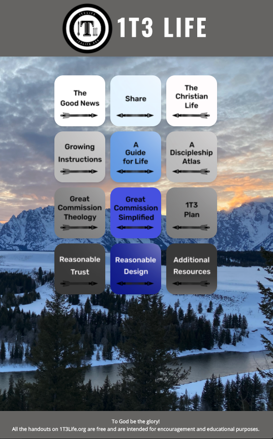
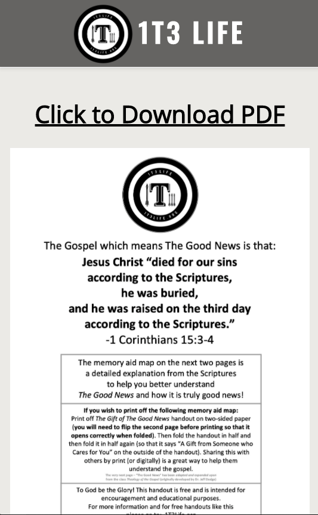
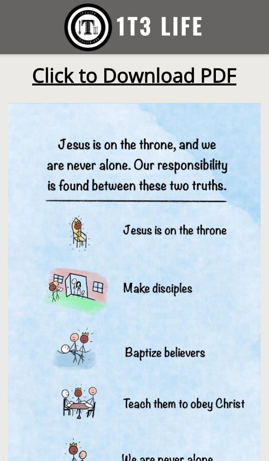

# 1T3 Life App

Link to live app: https://www.1t3life.org/

## Screen Shots

Main Page:

This page gives the user information about the app.

Content Pages:

These pages gives the user the option of downloading a pdf of the content and view the pdf content prior to downloading.

## Summary of App
This app allows users to access content for theological training purpose. The user can also download selected content in pdf format.

The App displays twelve squares to select. Each square directs the user to a content page, which allows the user to view the content and download the content.

## Technologies Used
React.js/Enzyme/HTML/CSS